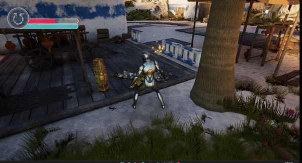

- [unRealRPG](#unrealrpg)
- [플레이 영상](#플레이-영상)
- [주요 기능](#주요-기능)
- [클래스 구조도](#클래스-구조도)
- [구현 사항](#구현-사항)
- [시행 착오](#시행-착오)

# unRealRPG
해당 프로젝트는 Unreal Engine 5.1 버전을 사용해 구현한 오픈 월드 방식의 액션 RPG 게임입니다.

# 플레이 영상
https://github.com/river-zero/unRealPG/assets/124229424/21bb3c5b-a1c2-455c-9a33-5e78b83c2c4b

# 주요 기능
|                                                                |                                                            |                                                                   |
| :------------------------------------------------------------: | :--------------------------------------------------------: | :---------------------------------------------------------------: |
|            |     |  |
|                         플레이어 이동                          |                   R키로 걷기/달리기 전환                   |             Inverse Kinematics를 이용한 발 위치 조정              |
|            |  |           |
|                         Space키로 점프                         |              V키로 백뷰/쿼터뷰 시점 전환 전환              |                       무장/비무장 상태 전환                       |
|          |    |              |
|                   마우스 왼쪽 클릭으로 공격                    |                  방향에 따른 히트 리액션                   |                          Alt키로 구르기                           |
|           |   |           |
|                        체력에 따른 죽음                        |                     부서지는 오브젝트                      |                       항아리에서 보물 스폰                        |
|            |      |              |
|                      몬스터에서 소울 스폰                      |                          적 순찰                           |                       플레이어 감지 및 추적                       |
|  |                                                            |                                                                   |
|                    모션 워핑을 이용한 공격                     |                                                            |                                                                   |
# 클래스 구조도

# 구현 사항
- 상속
  - AEnemy, ARPGCharacter는 ABaseCharacter 클래스에서 파생
  - ASoul, ATreasure, AWeapon는 AItem 클래스에서 파생
  - 상속 구조로 코드의 재사용성을 높이고 다형성을 활용
- 인터페이스
  - IHitInterface는 GetHit 함수를 통해 액터가 피격되었을 때의 동작을 정의
  - IPickupInterface는 SetOverlappingItem, AddSouls, AddGold 함수를 통해 아이템 획득 시의 동작을 정의
  - 인터페이스를 사용해 클래스 간의 의존성를 낮추고 유연한 상호작용을 도움
- 컴포넌트 기반 설계
  - 언리얼 엔진의 컴포넌트 시스템을 활용하여 기능을 모듈화하고 캡슐화
  - UAttributeComponent는 캐릭터의 속성을 관리하는 컴포넌트로 체력, 스태미나, 골드, 소울 등의 속성을 캡슐화하고 관련 기능을 제공
  - UHealthBarComponent는 체력 바를 표시하는 위젯 컴포넌트로 시각적인 표현을 담당
- 옵저버 패턴
  - AEnemy 클래스에서 UPawnSensingComponent를 사용하여 플레이어 캐릭터를 감지
  - 그리고 PawnSeen 함수를 통해 플레이어가 감지되었을 때의 동작을 정의
  - 이는 옵저버 패턴으로, 플레이어의 상태 변화를 감지하고 그에 따라 적의 동작을 조정할 수 있게 함
- 스테이트 패턴
  - ECharacterState, EActionState, EEnemyState 등의 열거형을 사용하여 캐릭터와 적의 상태를 관리
  - 각 상태에 따라 캐릭터와 적의 동작이 달라지며 상태 전이를 통해 동작을 제어
  - 이는 스테이트 패턴으로, 객체의 상태에 따라 동작을 변경할 수 있게 함
- 템플릿 메소드 패턴
  - AItem 클래스에서 BeginPlay, OnSphereOverlap, OnSphereEndOverlap 등의 가상 함수를 정의하고 파생 클래스에서 이를 재정의하여 사용
  - 이는 템플릿 메소드 패턴의 예로, 기본적인 뼈대를 정의하고 세부 구현은 파생 클래스에서 이루어지도록 함
- 블루프린트 활용
  - CreateFields 함수와 같이 블루프린트에서 구현할 수 있는 이벤트 함수를 제공
  - 이를 통해 C++과 블루프린트를 함께 사용할 수 있으며, 디자이너와 프로그래머 간의 협업을 원활하게 함
- 오버라이딩과 가상 함수
  - BeginPlay, Tick, GetHit, Attack, Die 등의 함수들이 가상 함수로 선언되어 있어 파생 클래스에서 필요에 따라 재정의함
  - 이를 통해 다형성을 활용하고 객체의 동작을 유연하게 조정

# 시행 착오
> 초기에는 플레이어 캐릭터를 언리얼 마켓플레이스에서 무료로 사용이 가능한 파라곤 캐릭터를 사용하고자 했습니다. 파라곤 캐릭터들은 무기가 같이 딸려오기 때문에 무기가 없는 상태를 구현하고자 방법을 찾았습니다. 첫번째 방법은 무기 재질을 투명하게 하는 방법, 두번째는 무기의 부모 본을 (0,0,0)으로 축소하는 방법이었습니다. 두번째 방법을 먼저 시도했는데 언리얼 엔진을 처음 다루는 시점이었기에 어떻게 블루프린트를 구성해야하는지조차 알기가 쉽지 않았습니다(애님그래프에서 Transform (Modify) Bone 노드를 만들고 Bone to Modify, Scale, Scale Mode를 설정하면 가능합니다.). 첫번째 방법은 무기 재질을 투명하게 만들었기 때문에 무기가 없는 상태에서의 애니메이션을 리타겟으로 추가해야했습니다. 유튜브에서 찾아보며 애니메이션 리타겟을 하는것까지 성공을 하였으나 착지 시에 땅까지 축소되었다가 다시 원상태로 복귀되는 문제가 발생하였고, 애니메이션 리타겟 과정에서 문제가 생긴것인가 싶어 기본 언리얼 스타트 팩에 있는 캐릭터를 사용하여 프로젝트를 시작했습니다.

> 언리얼 기본 캐릭터를 사용하여 점프-점프루프-착지 애니메이션을 구성하는 중에 착지 시에 캐릭터의 몸체가 땅까지 축소되었다가 다시 원상태를 되찾는 문제가 생겼습니다. 애니메이션 리타겟의 문제인가 싶어 리타겟을 여러번 재시도 해보기도 하였고, 메쉬를 바꿔서 시도하기도 했으나 실패했습니다. 그러다 같은 문제를 겪다가 해결한 분의 블로그 글을 보게 되었고 문제는 착지 애니메이션의 설정을 No Addtive로 하여 해결하였습니다. Additive Animation은 기본 애니메이션과의 차이를 현재 재생 중인 애니메이션에 더해주는 방식으로 동작하는데, 착지 애니메이션을 Additive Animation으로 설정했지만 Apply Additive 노드를 사용하지 않고 그대로 재생했기 때문에 문제가 발생한 것이었습니다. Apply Additive 노드를 사용하면 기본 애니메이션과 Additive Animation의 차이를 계산하여 자연스럽게 블랜딩해주는데 이 과정을 거치지 않아 캐릭터가 부자연스럽게 땅으로 축소했다가 복귀하는 문제가 발생했고, 따라서 Additive Animation을 사용할 때는 반드시 Apply Additive 노드를 통해 기본 애니메이션에 적용해주는 과정이 필요하며, 그렇지 않다면 애초에 Additive를 사용하지 않도록 설정해야 함을 알게 되었습니다.
